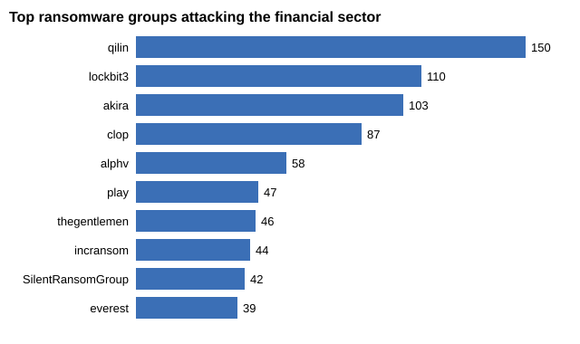
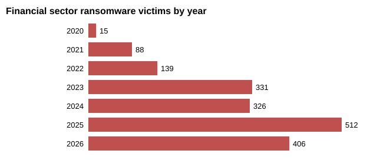

# Week 2 - Data Collection Process

Tasks from the syllabus: OSINT data collection with Shodan, VirusTotal and Maltego, and a data source mapping for analysis.

## What I did

1. Looked for public sources with ransomware data that fit the topic.
2. Wrote a script ([`scripts/osint_collect.py`](scripts/osint_collect.py)) that downloads the data.
3. Checked LockBit IP addresses in Shodan.
4. Made the data source table and two charts.

## 1. Data source mapping

| Source | Open / closed | What we get | Format | How | Used for |
|--------|---------------|-------------|--------|-----|----------|
| [ransomware.live](https://www.ransomware.live) | open | victims from leak sites: group, sector, country, date | JSON API | `osint_collect.py` | which groups attack finance and KZ |
| [CISA #StopRansomware](https://www.cisa.gov/stopransomware) | open (government) | IOCs and TTPs for Akira, LockBit, Clop | STIX 2.1 JSON | downloaded to `data/cisa/` | IOCs for MISP in week 3 |
| [Shodan InternetDB](https://internetdb.shodan.io) | open, no key | open ports, CVEs, hostnames of an IP | JSON API | `osint_collect.py` | enriching attacker IPs |
| [abuse.ch](https://abuse.ch) (MalwareBazaar, URLhaus, Feodo) | open | fresh malware hashes, bad URLs, botnet C2 | CSV / JSON | `curl` to `data/raw/` | what malware is active now |
| VirusTotal | free account + API key | reputation of files, URLs, IPs | JSON API | needs registration | checking CISA hashes |
| Maltego CE | free account | graph of links between domains, IPs, emails | GUI | needs registration | link analysis |
| Paid feeds (Recorded Future, Kaspersky TI) | closed | curated IOCs and reports | API | - | not available for students |
| Bank's own logs (SIEM, EDR) | closed, internal | real events inside the network | logs | - | real hunting |

Open sources are free, but the data can be noisy or old. Closed ones (paid feeds, internal logs) are more accurate, but you need money or access inside the company. For this project I only had open sources.

## 2. ransomware.live: who attacks finance

The script found 1823 ransomware victims in the Financial Services sector.



The top groups are Qilin, LockBit 3.0, Akira and Clop. Because of this I took IOCs for Akira, LockBit and Clop in week 3, since CISA has official reports with IOCs for them.



The number keeps growing: 331 victims in 2023, 512 in 2025, and 2026 already has 406 by September.

About Kazakhstan: ransomware.live shows 3 victims from KZ (lockbit5, clop and snatch; healthcare and hospitality). No public victims from the financial sector yet, but the same gangs that hit banks around the world are already working in KZ.

Only the summary numbers are in the repo (`output/ransomware_stats.json`). The raw victim lists stay in `data/raw/` which is in `.gitignore`.

## 3. Shodan: LockBit IP addresses

Normal Shodan search needs an account, so I used Shodan InternetDB. It's a free API with the same scan data. I checked the 15 IPs from the CISA LockBit advisory (AA23-325A).

| IP | Open ports | Notes |
|----|-----------|-------|
| 193.201.9.224 | 1050, 24442 | Shodan shows CVEs (CVE-2024-9287 and others) |
| 206.188.197.22 | 22 | only SSH |
| 168.100.9.137 | 22 | only SSH |
| 51.91.79.17 | 80, 443 | web server |
| 185.229.191.41 | 81, 443, 2083, 8080, 8442, 8443, 9000 | a lot of web/admin ports |
| 104.21.1.180, 172.67.129.176 | 80, 443, 2052-8880 | Cloudflare, the real server is behind the CDN |
| 8 other IPs | - | nothing in Shodan, probably offline |

Full output: [`output/shodan_internetdb.json`](output/shodan_internetdb.json).

So more than half of the IPs from a 2023 report are already dead. Attackers change infrastructure fast and IP IOCs get old quickly, which is exactly the Pyramid of Pain idea from week 1.

## 4. VirusTotal and Maltego

Both need a registered account, VirusTotal also needs an API key. For now I used free sources instead:
- CISA IOCs (already checked by analysts) and MalwareBazaar instead of VirusTotal
- Shodan InternetDB instead of Maltego graphs

Next step after registration: check the Akira SHA-256 hashes in VirusTotal.

## How to run

```bash
python3 week3/scripts/normalize_iocs.py   # run first, it makes the IP list
python3 week2/scripts/osint_collect.py
python3 week2/scripts/make_charts.py
```
