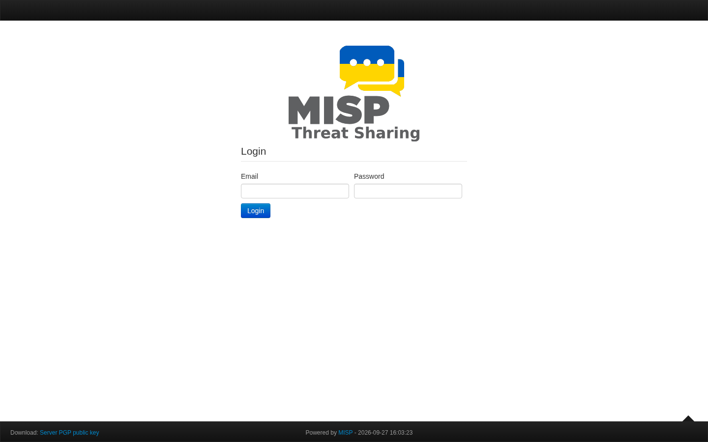
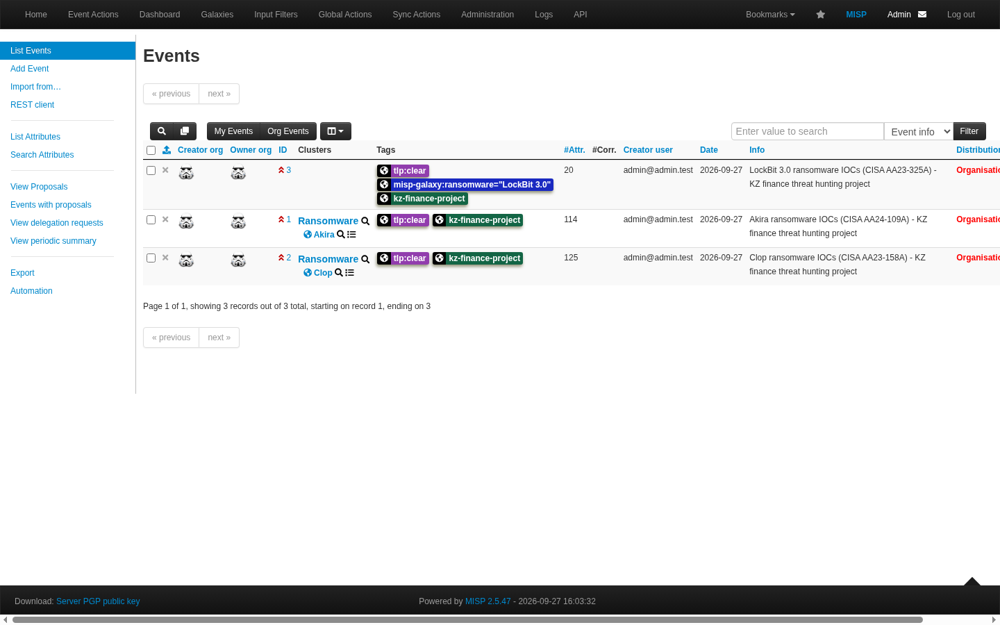
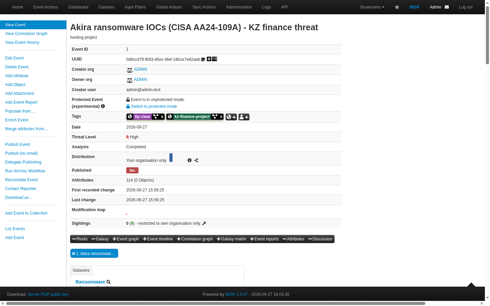
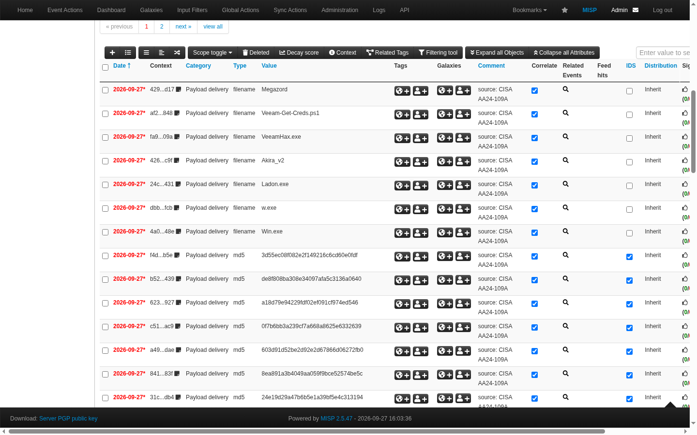
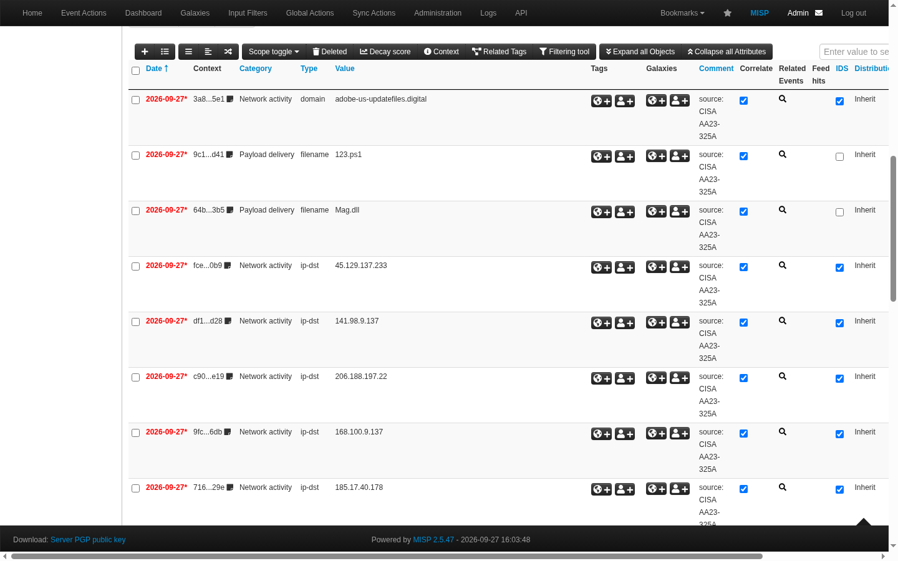
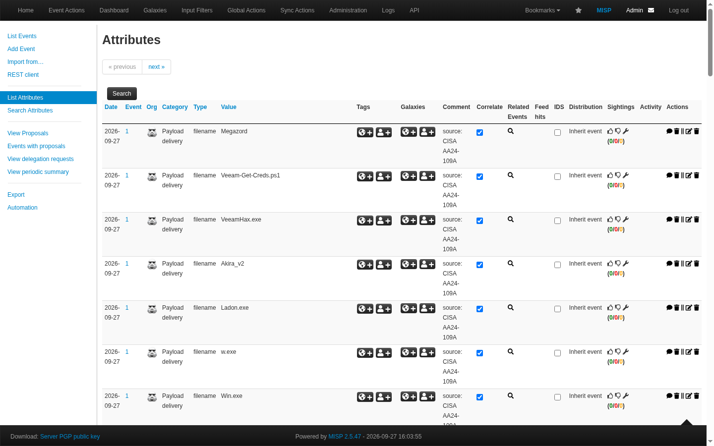
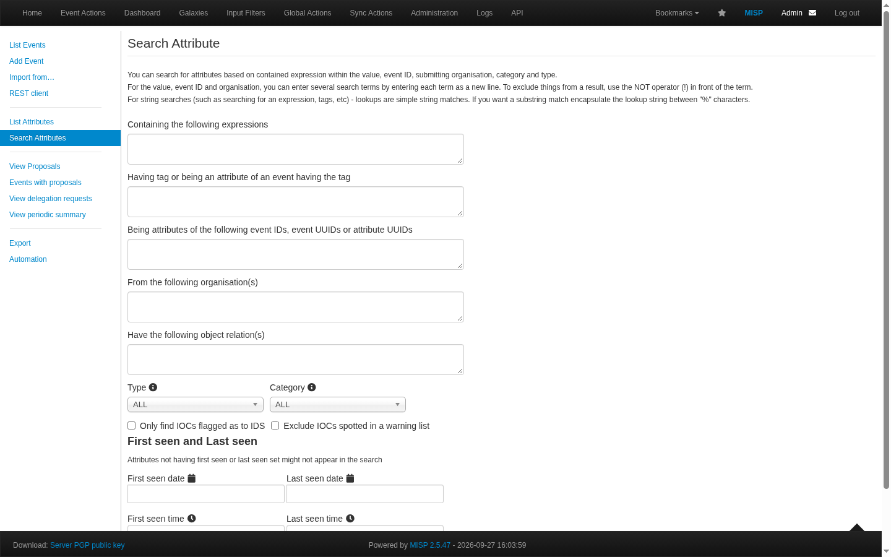

# Week 3 - Data Processing and Exploitation

Tasks from the syllabus: deploy MISP and import IOCs, apply filtering and normalization to the collected data.
Tools from the lecture: MISP, Elastic Stack, Sigma rules. Reading: MISP Training Documentation.

## Plan

```
CISA STIX reports (week 2) --> normalize_iocs.py --> iocs_normalized.csv --> import_to_misp.py --> MISP
                                 (clean, dedupe)        259 unique IOCs          3 events          misp_filter.py
```

## 1. Deploying MISP

I used the official [misp-docker](https://github.com/MISP/misp-docker) project and ran it with podman on Fedora.
Files: [`misp/docker-compose.yml`](misp/docker-compose.yml). Settings are in `misp/.env`, it's not in git because it has passwords.

```bash
cd week3/misp
cp template.env .env        # set BASE_URL, admin email, password and API key
podman-compose up -d
```

It didn't start on the first try, podman works a bit differently from Docker. What went wrong:

| Problem | Fix |
|---------|-----|
| podman couldn't pull `mariadb:10.11` and `valkey/valkey:7.2` (short names) | wrote the full names `docker.io/library/mariadb:10.11` and `docker.io/valkey/valkey:7.2` |
| rootless podman can't use ports 80 and 443 | changed them to 8081 and 8443 in `.env` |
| nginx: `unknown mount option "uid=101"` | changed the tmpfs options to `mode=0777` |
| nginx: "SSL certificate is NOT present" | made a self-signed certificate in `misp/ssl/` and added `:z` to the volume, SELinux was blocking it |

After that MISP 2.5.47 opened at `https://localhost:8443`.



## 2. Normalization and filtering before import

Script: [`scripts/normalize_iocs.py`](scripts/normalize_iocs.py). Input: 3 CISA reports in STIX (Akira AA24-109A, LockBit AA23-325A, Clop AA23-158A).

Steps:
1. Parsing: take the values out of STIX patterns like `[file:hashes.'SHA-256' = 'C0F7...']`
2. Type: decide the MISP type (md5, sha1 or sha256 by length, ip-dst, domain, url, filename)
3. Normalization: hashes and domains to lower case, remove the dot at the end of domains, refang things like `hxxp` and `[.]`
4. Filtering: drop private and loopback IPs (no use outside the victim's network) and SSDEEP hashes
5. Deduplication: every IOC is kept once, even if two reports have it

Result:

```
kept 259 unique IOCs, skipped 33
  Akira        filename  7     md5 34    sha1 31    sha256 42
  Clop         domain    6     filename 14    md5 41    sha256 54    url 10
  LockBit 3.0  domain    1     filename 2     ip-dst 15    sha256 2
```

Output: [`output/iocs_normalized.csv`](output/iocs_normalized.csv).

## 3. Import into MISP

Script: [`scripts/import_to_misp.py`](scripts/import_to_misp.py), it uses PyMISP and the MISP API key.

- one event for each group: Akira (114 attributes), Clop (125), LockBit 3.0 (20)
- tags: `tlp:clear` because the data is public, a ransomware galaxy tag and my own tag `kz-finance-project`
- hashes, IPs, domains and URLs have `to_ids = true` so they can be used for detection. File names have `to_ids = false`, because a name like `w.exe` alone would give tons of false positives

```
created event 1: Akira, 114 attributes
created event 2: Clop, 125 attributes
created event 3: LockBit 3.0, 20 attributes
```



Akira and Clop got linked to the Ransomware galaxy by themselves. LockBit 3.0 stayed a simple tag, because in the galaxy it's called just "LockBit".





In the LockBit event you can see that the file names (`123.ps1`, `Mag.dll`) have IDS unchecked, and the IPs and domain have it checked:





## 4. Filtering in MISP

Script: [`scripts/misp_filter.py`](scripts/misp_filter.py). I wrote a few questions a hunter could ask and answered them with the MISP `restSearch` API:

| Question | Filter | Results |
|----------|--------|---------|
| what network IOCs to block | type ip-dst / domain / url, to_ids | 32 |
| which Akira files EDR should look for | type sha256, tag Akira | 42 |
| what is in the Clop MOVEit report | tag Clop | 125 |
| only IOCs usable for detection | to_ids = true | 236 of 259 |
| blocklist for a firewall | type ip-dst, to_ids | 15 IPs |

Output: [`output/misp_filter_output.txt`](output/misp_filter_output.txt). The same search works in the web UI too (Event Actions, then Search Attributes):



## Conclusion

Raw data from different places is messy: different formats, upper and lower case, duplicates, junk values. After cleaning and importing I have one database with 259 IOCs in MISP and can get the exact list I need (for a firewall, for EDR, for one group) with a single query. Week 2 showed that a lot of IPs are already dead, so hashes and TTPs matter more. That leads to the Kill Chain and ATT&CK topics in the next weeks.

## How to run

```bash
python3 week3/scripts/normalize_iocs.py
export MISP_KEY=<API key from misp/.env>
python3 week3/scripts/import_to_misp.py
python3 week3/scripts/misp_filter.py
```
PyMISP is needed: `pip install pymisp`.
